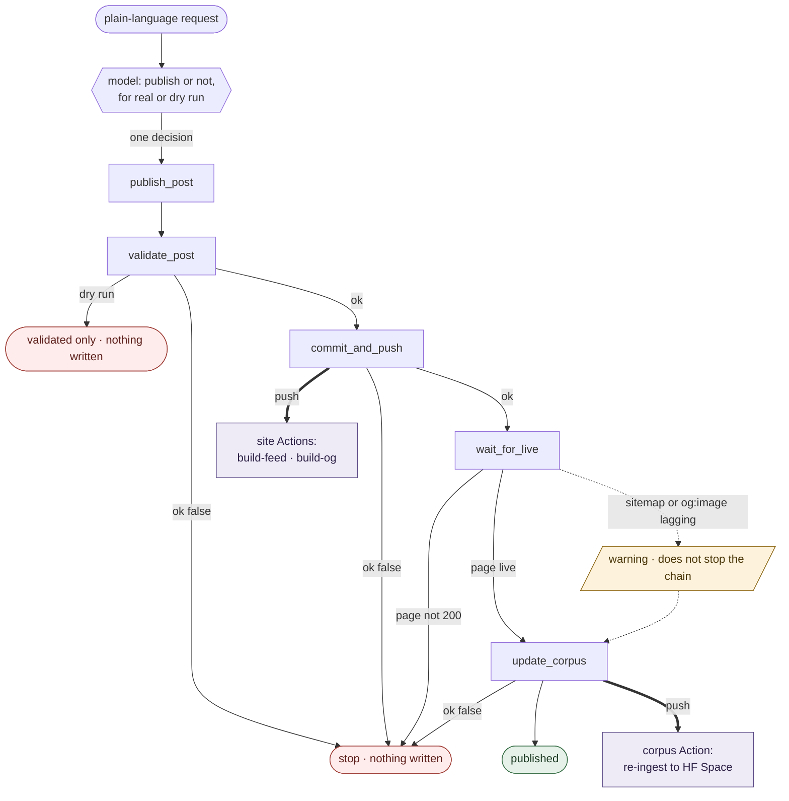

# rnv-publishing (MCP)

[](https://github.com/RNVizion/rnv-publishing-agent/actions/workflows/ci.yml)

A publishing agent for [rnvizion.dev](https://rnvizion.dev). One instruction ships a blog post end to end: it validates the post, commits and pushes, waits for the page to go live, then refreshes the retrieval assistant that answers questions about the site. The post's index card, RSS feed, and social share image are all rendered separately by CI, so the agent stays light.

A language model decides *whether* to publish. Deterministic tools do the work, in a fixed order, and refuse to ship anything broken.

Built on the Model Context Protocol (FastMCP) and the Anthropic API.

## It refuses

The most important thing this agent does is decline. A post missing a required field does not get published, and nothing downstream runs:

```console
$ python demo/run_demo.py

── Act 1: It refuses — a post that is not ready does not get published
  publish_post('half-written', for_real=True)
  {
    "slug": "half-written",
    "ok": false,
    "stopped_at": "validate_post",
    "trace": [
      {
        "step": "validate_post",
        "slug": "half-written",
        "ok": false,
        "missing_required": [
          "<article> block",
          "article:published_time"
        ],
        "missing_recommended": [
          "og:description",
          "card:summary",
          "article:author",
          "og:image"
        ]
      }
    ]
  }
  PASS stopped at validation; nothing committed
```

One step in the trace. No commit, no push, no corpus write, and an exact account of what was wrong. An agent that refuses is worth more than an agent that is usually right.

---

## The idea

The hard part of an agent isn't getting a model to call tools; it's keeping the failure modes legible when it does. This one draws a hard line between the two kinds of work:

- **Reasoning is the model's job.** It makes a single judgment from a plain-language request: publish this post, or don't; for real, or as a dry run.
- **Execution is the tools' job.** Every step that touches the filesystem, git, or the network is an ordinary Python function with one responsibility and a typed result. No step improvises.

The orchestration itself is code, not a prompt. `publish_post` runs the chain in sequence and stops at the first step that returns `ok: false`. That's deliberate: an earlier version let the model orchestrate the steps freely, and it occasionally skipped one. Moving the sequence into a tool removed that whole class of error. The model's only decision is the one a model is actually good at.

## The chain

`publish_post(slug, for_real)` runs, in order:

1. `validate_post` — checks the post carries everything the feed needs; **stops the publish if a required field is missing**
2. `commit_and_push` — stages and commits the post, then pushes
3. `wait_for_live` — polls the live URL until it returns 200, so nothing downstream runs against a page that hasn't deployed; then confirms the site itself caught up, by checking that the sitemap lists the post and that the `og:image` is reachable, flagging either if not
4. `update_corpus` — registers the post with the RAG corpus and triggers a rebuild

A **dry run** (`for_real=false`, the default) runs step 1 and stops, writing and pushing nothing. It confirms the post clears the required-field bar before any real publish.

The post's index card, RSS feed, and Open Graph share image are **not** the agent's job. Two GitHub Actions in the site repo handle them on the push from step 2: `build-feed` regenerates the blog index and `feed.xml` from the posts, and `build-og` renders the share image with Pillow and commits it back. The agent never writes the index, builds a feed, imports an image library, or stages a PNG.

## Refusal as a design value

The agent would rather publish nothing than publish something half-built.

- `validate_post` separates required fields from recommended ones; a missing required field halts the chain with an exact report of what's absent.
- `update_corpus` refuses to register a URL that isn't live, so the assistant's knowledge base never points at a 404.
- `wait_for_live` gates the corpus rebuild behind a confirmed-live page.

Each tool returns `{ ok, ... }`, so the chain reasons about success structurally instead of parsing prose.

**A live page proves less than it looks like it proves.** The deploy lands in two waves: this push puts the post's own file live, then the `build-feed` Action commits the blog index, the feed, and the sitemap, which go live a beat later. A 200 on the post URL only ever proved the first wave. In between, the post loads fine while the index and sitemap don't know it exists, so anything reading the site as a whole — a preview scraper, a crawler, a reader landing on the blog index — sees a half-updated site. Checking the page is checking that the front door opened; checking the sitemap is checking that the lights came on too. The sitemap only lists the post once `build-feed` has regenerated it, so finding the post there is proof the whole sequence ran.

Two checks are deliberately softer than the rest, and for the same reason. `wait_for_live` confirms the post's sitemap entry and its social image, but both are a **warning, not a gate**: the sitemap is regenerated by `build-feed` and the image rendered by `build-og`, each a beat after the push, so a slow CI run shouldn't fail an otherwise-good publish. Either one missing surfaces in the result as a warning naming the URL tried and the status returned; the post still publishes and the corpus still ingests, because both are correct without them.

The rule underneath: **gate a defect, warn about a queue.** A missing `<article>` block is the post's own defect and halts the chain. A render job that hasn't finished is nobody's defect. The test is ownership, not importance — a check that misses a problem costs you a post, but a gate that fails good work teaches you to route around it, and a gate you've learned to skip protects nothing while still looking like safety. Each advisory carries a pair of tests: one proving it warns when the thing is absent, one proving it goes quiet when the thing arrives. A warning that never falls silent stops being read.

If a consumer ever reads the sitemap rather than the post URL, that check stops being advisory.

## The tools

| Tool | Job |
| --- | --- |
| `list_posts` | Enumerate published posts with slug, title, date |
| `validate_post` | Gate: required vs. recommended fields |
| `commit_and_push` | Stage and commit the post, push |
| `wait_for_live` | Poll until the page serves 200, then confirm the sitemap lists it and the `og:image` renders (both warn-only) |
| `update_corpus` | Register the post and trigger a RAG rebuild |
| `publish_post` | Run the whole chain, stopping at the first failure |

## Usage

Run from **this repo** (the agent), not the site checkout: `server.py` and `agent.py` live here, and the site repo is a sibling this agent writes into.

Two routes. Both honour the same `for_real` gate.

**Direct — no API key.** The tools are plain functions; this is the call shape `demo/run_demo.py` uses internally.

```bash
# rehearse - validates the post and stops, writes nothing
python -c "import server, json; print(json.dumps(server.publish_post('<slug>'), indent=2))"

# ship it - runs the full chain
python -c "import server, json; print(json.dumps(server.publish_post('<slug>', for_real=True), indent=2))"
```

**Conversational — needs `ANTHROPIC_API_KEY`.** Sonnet reads the instruction and picks the tools.

```bash
python agent.py "Publish <slug> as a dry run."
python agent.py "Publish <slug> for real."
```

A dry run is correct when `trace` holds exactly one element, the `validate_post` step. The absence of the write steps from that trace is the gate; don't take the `dry_run: true` flag's word for it.

On a real publish, `wait_for_live` gates on the post URL (180s), then polls the `og:image` (90s) and the sitemap (60s) as advisories. A warning on either is a **successful publish** reporting that a site-repo Action hasn't drained yet; the post is live and the corpus has ingested it. Check the share card a minute later before sharing anywhere that unfurls a link preview.

## How it fits together

The agent edits the **site** repo directly and pushes natively. The heavier work runs in CI instead, where it belongs:

- **The index, feed, and share image.** On the push, two Actions in the site repo regenerate the blog index and RSS feed from the posts (`build-feed`) and render the per-post Open Graph image (`build-og`), each committing its output back. Image rendering, font handling, and HTML generation never touch the publishing environment.
- **The RAG rebuild.** `update_corpus` commits a one-line source change to the corpus repo, and a GitHub Action there re-ingests and pushes the vector store to a Hugging Face Space. The heavy ML dependencies and the Hugging Face token stay in CI, never in the publishing environment.



Every solid edge is deterministic code. The only model decision is the diamond at the top. The dotted path is the deliberate leniency: a lagging sitemap or share image warns and continues, because both are the second wave's timing rather than the post's defect.

## Setup

Run from **this repo**, not the site checkout.

```bash
python -m venv .venv
source .venv/bin/activate          # Windows / Git Bash: source .venv/Scripts/activate
pip install -r requirements.txt    # add -r requirements-dev.txt for the test tooling
```

Environment:

- `BLOG_REPO` — path to the site checkout (default `/workspaces/rnvizion.github.io`)
- `CORPUS_REPO` — path to the corpus checkout (default `/workspaces/rnv-ask-the-corpus`)
- `SITE_URL` — live origin for `wait_for_live` (default `https://rnvizion.dev`)
- `ANTHROPIC_API_KEY` — **only** for `agent.py`. The tools, the demo, and the test suite need no key.

Those defaults are Codespace paths. **Off a Codespace, set all three explicitly.** An unset variable falls through to a path that doesn't exist and fails late, at commit or corpus time, with a message that doesn't name the real cause. On Windows use `C:/Users/...` form; native Python can't resolve Git Bash's `/c/Users/...`.

Off a Codespace you also need push access to the site repo, which a Codespace grants natively. Confirm with `git push --dry-run` from the site checkout before publishing for real; without it the chain commits locally and then fails at the push.

A preflight that checks the values rather than an exit code:

```bash
python -c "
import os
from pathlib import Path
for k in ('BLOG_REPO','CORPUS_REPO'):
    v = os.environ.get(k)
    print(k, '=', v, '| is a dir:', Path(v).is_dir() if v else False)
print('SITE_URL =', repr(os.environ.get('SITE_URL')))
"
```

Dependencies are the MCP SDK and the Anthropic SDK, both with upper bounds. The agent does no image, feed, or HTML rendering, so Pillow and the like are not dependencies here — that work lives in the site repo's build workflows.

## Try it without touching anything of mine

```bash
pip install -r requirements.txt
python demo/run_demo.py
```

No API key, no credentials, no network. The script builds two git repositories and their bare remotes in a temp directory, serves them over a local HTTP server, and runs **the real chain** against them — real commits, real pushes, real liveness polling. Only the destination is disposable; the code path is the one that runs in production.

It walks five acts and asserts each one:

| Act | Shows |
| --- | --- |
| 1 | A draft is refused at validation; nothing is committed |
| 2 | `for_real` defaults to false; a default call writes nothing |
| 3 | A real publish runs all four steps — and warns that neither the sitemap nor the share image has caught up yet |
| 3b | The same publish when the second-wave jobs finish in time: the polls catch both, no warning |
| 4 | Running it again is idempotent — nothing to commit, source already registered |

`--keep` leaves the workspace on disk if you want to inspect the repos afterwards.

## Tests

```bash
pip install -r requirements-dev.txt
python -m pytest tests -q
```

The suite runs against real git repositories with real bare remotes; only the calls to the live site are substituted, and those at the `urllib` boundary rather than inside the tools. What it pins:

- **`tests/test_refusal.py`** — the claims this project makes about itself. A missing required field halts the chain and writes nothing; `for_real` defaults to false; a dry run leaves `git log` untouched. If these fail, the project has stopped doing the thing it says it does.
- **`tests/test_chain.py`** — the full sequence in order, the commit actually landing in the remote, the corpus write, idempotency on a second run, and the two-speed liveness check: the page is a gate, the share image is advisory.
- **`tests/test_parsing.py`** — the edge cases the docstrings claim to handle. Apostrophes inside meta content, single-quoted attributes, and metadata inside an HTML comment not counting as present.
- **`tests/test_mcp_surface.py`** — the protocol layer, over a real stdio transport. Every other test imports `server` and calls its functions directly, which skips registration entirely; a tool accidentally unregistered or renamed would pass all of them and fail here. It also asserts the gate holds when driven through the transport rather than in-process.

A note on how the suite fails. An earlier version of these tests could *hang* on the single most important regression: flipping `publish_post`'s `for_real` default to true made the dry-run test start a real publish and sit in a 180-second poll, which in CI is a stuck runner rather than a red X. The `no_real_network` fixture now blocks any undeclared network call and names the URL, so that regression fails in under three seconds; the workflow's `timeout-minutes` is the backstop for whatever the fixture didn't anticipate.

CI runs the suite on Python 3.11 and 3.12, then runs the end-to-end demo as a separate job — because "try it yourself" is a claim about someone else's machine, and the only honest way to make it is to have a machine that is not mine run it on every push.

## What this demonstrates

For anyone reading this as work rather than docs:

- **Agentic design that's safe by construction.** The model holds one decision; the pipeline is deterministic code. Failures are typed and stop the chain, not silent.
- **MCP as a tool layer.** A clean FastMCP server with small, single-purpose, idempotent tools that compose.
- **Integrity gating.** "Refuse to ship broken" is enforced in code, at three points, not left to a prompt — and checked by a test suite rather than asserted here.
- **The right work in the right place.** Index and feed generation, image rendering, and ML rebuilds all run in CI; the agent stays a light, legible orchestrator. The division is the design.
- **Real automation on a real system.** It extends an existing static site, feed, and retrieval assistant; it isn't a toy built to demo the pattern.

---

Built by Christian Smith ([RNVizion](https://rnvizion.dev)).
